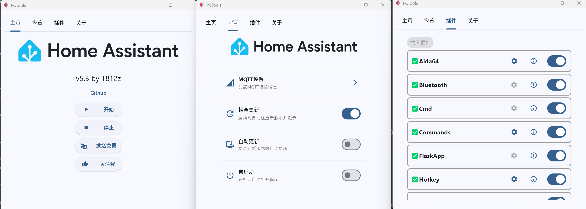

# 🖥️ PCTools

> 简单的 Python 程序，让 Windows 与 Home Assistant 无缝集成，实现硬件监控、远程控制等功能。

[](https://github.com/1812z/PCTools/releases/latest)
[](https://github.com/1812z/PCTools/releases)
[](https://github.com/1812z/PCTools)
[](LICENSE)

---

## ✨ 功能特性

| 功能 | 描述 |
|------|------|
| 📊 **Aida64 监控** | 定时更新选定传感器数据 |
| 🎮 **远程命令** | 自动同步 `commands` 文件夹内的 `.bat` `.lnk` 文件到 HA |
| 📸 **Web 监控** | 屏幕截图 / 摄像头 / 实时画面串流 |
| 💬 **消息通知** | 监听 HA 文本输入，以 Toast 消息显示 |
| 🌐 **侧边栏网页** | 快捷键呼出 HA 网页侧边栏 |
| ⌨️ **快捷键联动** | 快捷键触发 HA 二元传感器 |
| 📱 **前台应用反馈** | 自动上报当前应用名称，支持 [Runtime Tracker](https://github.com/1812z/RunTime_Tracker) |
| 🖥️ **显示器控制** | 多显示器亮度 / 开关 / DDC-CI 命令 |
| 🔊 **音量控制** | 控制 Windows 系统音量 |
| 🌙 **深色模式** | 切换系统/应用深色模式 |
| 📶 **蓝牙控制** | 开关系统蓝牙 |
| ⚡ **命令行** | 执行自定义 CMD/PowerShell |
| 🎨 **壁纸引擎** | 控制 Wallpaper Engine |
| ⌨️ **按键模拟** | 模拟键盘输入（含媒体键） |
| 🔗 **URL 启动器** | 打开自定义 URL |

**Web 监控端点：**
- 屏幕截图：`http://127.0.0.1:5000/screenshot.jpg`
- 摄像头：`http://127.0.0.1:5000/video_feed`
- 实时画面：`http://127.0.0.1:5000/screen`

---

## 📷 截图展示

<details>
<summary>🖼️ 软件界面</summary>

</details>

<details>
<summary>📱 HA 界面</summary>

**另类副屏** (推荐配合 [HA_Helper](https://github.com/1812z/Ha_Helper))


**主页面**


</details>

---

## 🚀 快速开始

### 1️⃣ 安装环境

**方式一**：下载 [Releases](https://github.com/1812z/PCTools/releases/latest) 内的压缩包（内置运行环境）

**方式二**：手动配置
```bash
# Python 3.12
pip install -r requirements.txt
```

### 2️⃣ 安装第三方依赖软件(可选)

| 依赖 | 用途 |
|------|------|
| MQTT 服务器 | 接入 Home Assistant |
| [Aida64](https://github.com/1812z/PCTools/releases) | 硬件信息监控 |
| [Twinkle Tray](https://github.com/xanderfrangos/twinkle-tray/releases) | 显示器亮度调节 |

### 3️⃣ 配置依赖

1. **Aida64**：开启内存共享并勾选需要的传感器数据
2. **Twinkle Tray**：确保能正常读取显示器信息
3. **壁纸引擎**：启动以支持相关操作

> 💡 新增/修改传感器后，如有冲突，请删除 HA/MQTT 内的设备并重启软件

### 4️⃣ 运行程序

1. 运行 `打开GUI.bat` 启动界面
2. 进入设置配置参数（**按回车保存**）
3. 启用所需插件（**建议重启程序**）
4. 点击启动，在 HA 的 MQTT 集成中查看新设备

### 5️⃣ 开机自启（可选）

设置中点击 **自启动**，程序将后台运行，在系统托盘查看图标

---

## 📋 开发计划

- [x] 键盘快捷键联动
- [x] 代码优化
- [x] 插件逻辑优化
- [ ] 电脑风扇控制
- [ ] Toast 多按钮回调
- [ ] 插件市场
- [ ] 媒体控制
- [ ] 网易云歌词同步

---

## 💡 推荐搭配

| 软件 | 描述 |
|------|------|
| [OpenRGB](https://openrgb.org/) | RGB 灯光控制，支持 HA 接入 |
| [HASS.Agent](https://github.com/hass-agent/HASS.Agent) | 更稳定的同类工具 |

---

## 致谢

- [python_aida64](https://github.com/gwy15/python_aida64) - Aida64 数据读取

---

## 📝 其他

- 支持无头模式：`python core.py`
- 部分页面需切换后才会刷新
